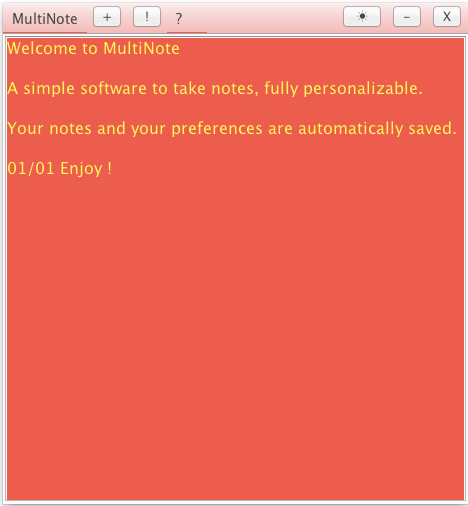
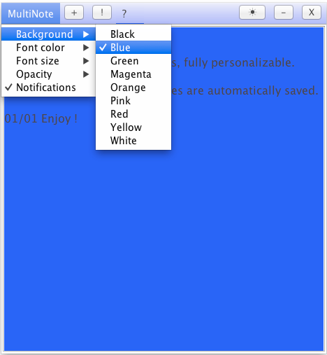

# Multinote
A note application

##Screenshots

##Notes

Builds needs toaster.jar (available on my github) use ant to package toaster.jar into a single .jar

Usable jar is provided in "Release" folder. toaster.jar is provided in "dist" folder.

##Possible improvements

- Improve save (with serialization)

## License

Released under Apache License 2.0
